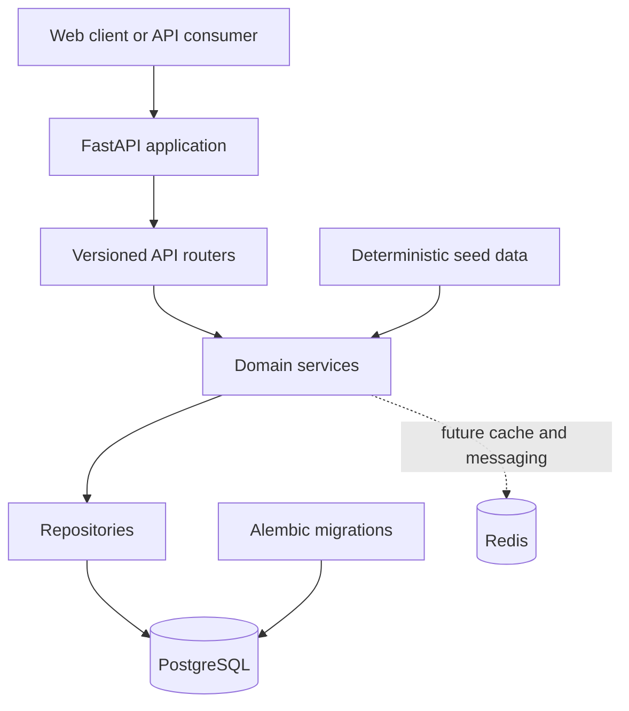

# RailwayOS

### A modular railway operations platform for schedules, network data, and operational workflows

RailwayOS is an API-first railway operations platform built with FastAPI. It
models stations, trains, coaches, seats, routes, dated services, timetable
stops, users, roles, and audit events using deterministic synthetic data.

The project focuses on maintainable engineering: clear domain boundaries,
database migrations, repeatable seed data, automated tests, and CI quality
checks.

For a quick local verification, run `python -m pytest backend/tests` from the
repository root after installing the backend development dependencies.

> RailwayOS is a simulation and portfolio project. It is not connected to an
> official railway operator and must not be used for safety-critical dispatch
> or real passenger transactions.

## What it provides

- Synthetic railway network data for stations, routes, trains, coaches, seats,
  and timetables.
- REST APIs for creating and browsing network resources.
- Search and bounded pagination with deterministic ordering.
- Dated train services with ordered timetable stops.
- Liveness and database-readiness probes.
- Identity models for users, roles, assignments, and audit events.
- Password hashing and credential verification services.
- Idempotent seed operations for repeatable demonstrations.
- Generated OpenAPI documentation through FastAPI.

## Platform overview

RailwayOS turns railway network information into a dependable operational
workspace. Instead of treating a railway as a collection of disconnected
tables, the platform connects physical assets, network topology, and dated
operations into one consistent model.

### Core value pillars

| Capability | What it means |
|---|---|
| Network visibility | Stations, routes, trains, coaches, seats, and service stops are represented together. |
| Operational correctness | Constraints, normalized identifiers, bounded queries, and transactional persistence protect data quality. |
| Reproducible environments | Migrations and deterministic seed data make local demos and tests repeatable. |
| Extensible foundation | Identity, roles, and audit events provide a base for protected staff and passenger workflows. |
| Developer confidence | API contracts, isolated database fixtures, CI, linting, and 70+ automated tests support change safely. |

## The three operational perspectives

### Passenger and public information

Public-facing clients can discover stations, routes, trains, and dated services
through predictable APIs. Search, pagination, ordered stops, and clear not-found
responses make the network data suitable for a future journey-search experience.

### Operations staff

Operations workflows are built around the relationship between a train, its
route, its service date, and its timetable stops. The identity and role model
is designed to support protected operational actions and an auditable history
as those workflows are added.

### Platform administrators

Administrators receive a maintainable foundation for managing users, roles,
synthetic network data, migrations, and service health. Repeatable seeding and
database-readiness checks make the system easier to operate in development and
deployment environments.

## End-to-end operating flow

```text
Network catalog
      ↓
Stations and routes
      ↓
Trains, coaches, and seats
      ↓
Dated train services
      ↓
Ordered timetable stops
      ↓
Passenger, operations, and analytics workflows
```

The same identifiers and relationships are used throughout the flow. A route
contains ordered stations, a dated service runs a train on that route, and
service stops describe the timetable exposed to API consumers.

The current implementation establishes the network and identity foundation.
Passenger booking, live tracking, notifications, analytics, and operations
dashboards are separate domain areas intended to build on this foundation.

## Architecture

RailwayOS uses a modular monolith: one deployable FastAPI application with
explicit internal layers. This keeps local development and transactions simple
while preserving boundaries that can later be extracted into services.



### Request flow

1. FastAPI receives a request and selects a versioned router.
2. Pydantic schemas validate and normalize input.
3. Domain services apply business rules such as duplicate detection.
4. Repositories execute SQLAlchemy queries.
5. Typed response models return predictable API data.

### Architecture principles

| Principle | Implementation |
|---|---|
| Modular monolith | Domain modules share one process and transaction boundary. |
| API-first design | Typed FastAPI routes generate OpenAPI documentation. |
| Database integrity | SQLAlchemy models, constraints, foreign keys, and Alembic migrations. |
| Synthetic data only | Seed catalogs are deterministic and clearly separated from real data. |
| Testable boundaries | API, schema, service, repository, and seed behaviour are tested. |
| Operational readiness | Liveness and database-readiness probes support deployments. |

## Core domain model

```text
Station ──< RouteStop >── Route
   │                         │
   └────── ServiceStop >── TrainService ── Train ──< Coach ──< Seat

User ──< UserRole >── Role
  │
  └──< AuditEvent
```

- **Station** — active railway station with a unique normalized code.
- **Route** — ordered network path between stations.
- **RouteStop** — station position and distance along a route.
- **Train** — trainset identified by a unique numeric number.
- **Coach and Seat** — train capacity and berth-level inventory entities.
- **TrainService** — dated operation of a train over a route.
- **ServiceStop** — scheduled arrival, departure, and platform information.
- **User, Role, and AuditEvent** — identity, authorization, and security history.

## Repository structure

```text
railway-os-platform/
├── backend/
│   ├── app/api/v1/       # Versioned endpoints and schemas
│   ├── app/core/         # Configuration, security, and shared utilities
│   ├── app/db/           # SQLAlchemy engine and sessions
│   ├── app/models/       # ORM entities and relationships
│   ├── app/repositories/ # Database access functions
│   ├── app/services/     # Domain rules and use cases
│   ├── app/seed/         # Synthetic network seed logic
│   ├── migrations/       # Alembic migration history
│   └── tests/            # Pytest test suite
├── docs/                 # Architecture, setup, ERD, and API notes
├── scripts/              # Setup and quality-check helpers
├── database/             # Database support files
├── docker-compose.yml    # Local PostgreSQL and Redis
└── .github/workflows/    # Continuous integration
```

## API surface

The versioned API is served under `/api/v1`. Interactive documentation is
available at `/docs` while the server is running.

| Resource | Endpoints | Purpose |
|---|---|---|
| Health | `GET /health`, `GET /api/v1/health`, `GET /api/v1/ready` | Liveness and database readiness |
| Stations | `GET/POST /api/v1/stations`, `GET /api/v1/stations/{id}` | Browse and create stations |
| Trains | `GET/POST /api/v1/trains`, `GET /api/v1/trains/{id}` | Browse and create trains |
| Coaches | `GET/POST /api/v1/trains/{id}/coaches` | Manage train coaches |
| Routes | `GET/POST /api/v1/routes`, `GET /api/v1/routes/{id}` | Browse and create routes |
| Route stops | `GET/POST /api/v1/routes/{id}/stops` | Manage ordered route stations |
| Services | `GET/POST /api/v1/services`, `GET /api/v1/services/{id}` | Browse dated services |

List endpoints support bounded `offset` and `limit` parameters. Searchable
resources normalize input and return deterministic ordering.

## Technology stack

| Layer | Technology |
|---|---|
| API | Python 3.11+, FastAPI, Uvicorn |
| Validation | Pydantic v2 and pydantic-settings |
| Persistence | SQLAlchemy 2, PostgreSQL, Alembic |
| Cache and messaging | Redis |
| Authentication foundation | Passlib password hashing |
| Testing | Pytest, HTTPX, SQLite-isolated fixtures |
| Quality | Ruff, MyPy configuration, pre-commit, GitHub Actions |
| Infrastructure | Docker Compose |

## Local setup

### Prerequisites

- Python 3.11 or newer
- Docker Desktop with Compose
- Git

### Configure and start infrastructure

```bash
git clone https://github.com/vaibhavmishra-sde/Railway-os.git
cd railway-os-platform
cp .env.example .env
docker compose config
docker compose up -d
```

On Windows PowerShell, use `Copy-Item .env.example .env` instead of `cp`.
Update `.env` with local development credentials and never commit that file.

### Install and run the backend

Windows PowerShell:

```powershell
.\scripts\setup-backend.ps1
Set-Location backend
alembic upgrade head
python -m uvicorn app.main:app --reload
```

macOS, Linux, or Git Bash:

```bash
bash scripts/setup-backend.sh
cd backend
alembic upgrade head
python -m uvicorn app.main:app --reload
```

Useful URLs:

- API: <http://127.0.0.1:8000>
- Swagger UI: <http://127.0.0.1:8000/docs>
- Liveness: <http://127.0.0.1:8000/health>
- Readiness: <http://127.0.0.1:8000/api/v1/ready>

## Configuration

The backend reads environment variables from `.env`. The main configuration
groups are `POSTGRES_*` for the database, `REDIS_*` for Redis, `APP_NAME` and
`APP_VERSION` for API metadata, `API_PREFIX` for versioning, and
`TEST_DATABASE_URL` for optional integration-test overrides.

See [.env.example](.env.example) and
[docs/environment-guide.md](docs/environment-guide.md) for the complete list.

## Testing and quality

Run the complete backend verification from the repository root:

```powershell
.\scripts\check-backend.ps1
```

```bash
bash scripts/check-backend.sh
```

Or run individual checks from `backend/`:

```bash
pytest
ruff check .
ruff format --check .
```

The suite covers API contracts, schemas, repositories, services, migrations,
seed idempotency, identity models, password hashing, and database-isolated
integration behaviour. GitHub Actions runs the backend checks on Python 3.11
and 3.12.

## Security and reliability

- Secrets are loaded from environment configuration and excluded from Git.
- Passwords are stored as one-way PBKDF2-SHA256 hashes.
- Email identifiers and station codes are normalized before persistence.
- Database sessions are closed in `finally` blocks.
- Constraints and foreign keys protect duplicate and orphaned records.
- Readiness checks execute a database query before reporting the service ready.
- Seed operations are safely repeatable.
- All operational data in this project is synthetic or simulated.

## Documentation

- [Architecture overview](docs/architecture.md)
- [Entity relationship notes](docs/erd.md)
- [Local environment guide](docs/environment-guide.md)
- [Local setup guide](docs/local-setup.md)
- [API examples](docs/day-027-api-examples.md)
- [Authentication design](docs/day-029-auth-design.md)
- [Identity implementation](docs/day-030-implementation.md)

## License

RailwayOS is released under the [MIT License](LICENSE).
