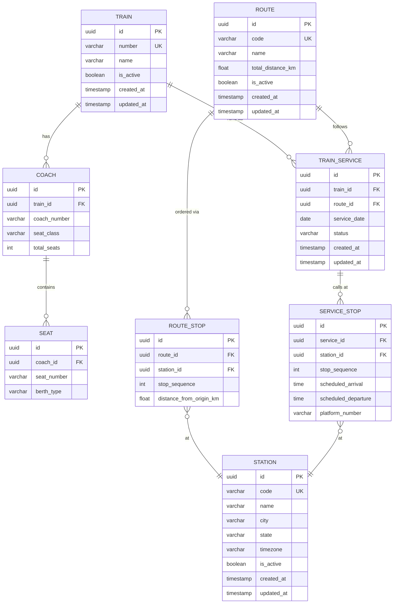

# RailwayOS — Entity Relationship Diagram

Generated as part of Day 015 (Month 1, Week 3).

## Notes

- `COACH.seat_class` is an application-level enum stored as `VARCHAR`.
  Valid values: `FIRST_AC`, `SECOND_AC`, `THIRD_AC`, `SLEEPER`, `GENERAL`.
- `TRAIN_SERVICE.status` enum: `SCHEDULED`, `RUNNING`, `COMPLETED`, `CANCELLED`.
- `SEAT.berth_type` enum: `LOWER`, `MIDDLE`, `UPPER`, `SIDE_LOWER`, `SIDE_UPPER`, `SEAT`.
- Unique constraints:
  - `COACH(train_id, coach_number)`
  - `SEAT(coach_id, seat_number)`
  - `ROUTE_STOP(route_id, stop_sequence)` and `(route_id, station_id)`
  - `TRAIN_SERVICE(train_id, service_date)`
  - `SERVICE_STOP(service_id, stop_sequence)`
